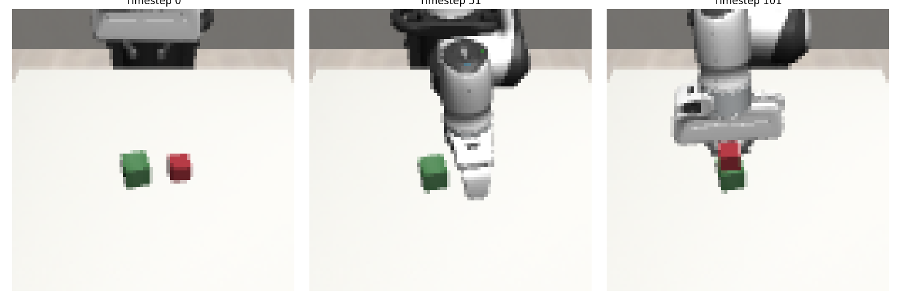

# Tactile-Enhanced Robotic Manipulation

A reinforcement learning project demonstrating how simulated tactile feedback enhances robotic manipulation for humanoid robotics applications. This project augments the RoboMimic dataset with simulated tactile sensors to improve sample efficiency and manipulation performance.

## Project Overview

This project showcases how tactile sensing can significantly improve manipulation tasks relevant to humanoid robotics. Using a 2-finger gripper simulation (with potential extension to more complex hands), we:

1. Augment existing demonstrations with simulated tactile feedback
2. Train both tactile-enhanced and standard models
3. Compare performance across various manipulation challenges
4. Visualize the impact of tactile sensing on decision-making

## Key Features

- **Tactile Sensing Simulation**: 3×4 taxel grid on each gripper finger with simulated capacitive response
- **Multi-Modal Learning**: Integration of visual, proprioceptive, and tactile information
- **Sample Efficient Learning**: Offline reinforcement learning using demonstration data
- **Comparative Analysis**: Performance metrics with and without tactile feedback
- **Object Manipulation**: Support for cube stacking tasks with visualization of object interactions

## Installation

### Prerequisites

- macOS with M1/M2 chip
- Python 3.8+
- 32GB RAM recommended

### Environment Setup

Create a new conda environment
conda create -n tactile-rl python=3.8
conda activate tactile-rl

# Install MuJoCo
pip install mujoco

# Install PyTorch (Apple Silicon version)
pip install torch torchvision torchaudio

# Install other dependencies
pip install numpy h5py matplotlib imageio pandas

### Known Issues and Troubleshooting

#### MuJoCo Rendering
There are known issues with MuJoCo's interactive rendering on some platforms. If you encounter rendering problems:

1. Try setting the MUJOCO_GL environment variable:
export MUJOCO_GL=egl  # Try 'egl', 'glfw', or 'osmesa'

2. If interactive viewing doesn't work, use the headless video generation:
mjpython -m scripts.replay_full_robot --dataset ../datasets/core/stack_d0.hdf5 --demo 3 --no-render --save-video --playback-speed 0.1

3. Videos will be saved to the `../exps` directory by default.

#### Robot Movement Issues
If robot movement appears too fast or too slow compared to object movement:

1. The script will automatically analyze action ranges and suggest an appropriate scaling factor
2. Try using `--control-mode position` with a lower `--action-scale` value (typically 1.0-5.0)
3. For accurate timestamps, use `--playback-speed 0.002` to match the simulation time step
4. Note that object positions are set directly from the dataset while robot movement is physics-based

### Dataset Setup

# Download RoboMimic dataset (choose one or more tasks)
python -m robomimic.scripts.download_datasets --tasks can_picking
python -m robomimic.scripts.download_datasets --tasks lift
python -m robomimic.scripts.download_datasets --tasks square_insertion
python -m robomimic.scripts.download_datasets --tasks stack

## Project Structure

tactile-rl/
├── data/                        # Datasets and processed data
├── environments/                # Custom MuJoCo environments
│   ├── tactile_gripper.py       # Gripper with tactile sensors
│   └── tactile_sensor.py        # Tactile sensor implementation
├── franka_emika_panda/          # Robot and environment models
│   ├── panda.xml                # Original robot model
│   ├── mjx_panda.xml            # MuJoCo X compatible model
│   ├── mjx_two_cubes.xml        # Model with two interactive cubes
│   ├── stack_d0_compatible.xml  # Enhanced model with tactile sensors
│   └── original_stack_environment.xml # Original environment from dataset
├── models/                      # Neural network architectures
│   ├── policy_network.py        # Policy networks with tactile processing
│   └── tactile_encoder.py       # Encoder for tactile information
├── scripts/                     # Utility scripts
│   ├── augment_dataset.py       # Add tactile data to demonstrations
│   ├── replay_full_robot.py     # Replay demonstrations with the full robot
│   ├── visualize_tactile.py     # Visualize tactile readings
│   └── extend_shadow_hand.py    # Optional extension to 5-finger hand
├── training/                    # Training algorithms
│   ├── bc_training.py           # Behavior Cloning implementation  
│   └── cql_training.py          # Conservative Q-Learning implementation
├── visualization/               # Visualization tools
├── main.py                      # Main training script
└── evaluate.py                  # Evaluation script

## Usage

### Replaying Demonstrations with Tactile Sensing

# Generate a video of a demonstration with tactile readings
mjpython -m scripts.replay_full_robot --dataset ../datasets/core/stack_d0.hdf5 --demo 3 --save-video --playback-speed 0.002 --camera 1

# Use position control mode with appropriate action scaling (recommended)
mjpython -m scripts.replay_full_robot --dataset ../datasets/core/stack_d0.hdf5 --demo 3 --save-video --control-mode position --action-scale 3 --playback-speed 0.002

# Use velocity control mode for more responsive movement (may not match original data)
mjpython -m scripts.replay_full_robot --dataset ../datasets/core/stack_d0.hdf5 --demo 3 --save-video --control-mode velocity --action-scale 10 --playback-speed 0.002

# Use the original environment for most accurate replay
mjpython -m scripts.replay_full_robot --dataset ../datasets/core/stack_d0.hdf5 --demo 3 --save-video --model franka_emika_panda/original_stack_environment.xml

# Use the enhanced environment with tactile sensors
mjpython -m scripts.replay_full_robot --dataset ../datasets/core/stack_d0.hdf5 --demo 3 --save-video --model franka_emika_panda/stack_d0_compatible.xml

# Use a simplified model with just two cubes
mjpython -m scripts.replay_full_robot --dataset ../datasets/core/stack_d0.hdf5 --demo 3 --save-video --model franka_emika_panda/mjx_two_cubes.xml 

# Adjust playback speed for slower motion
mjpython -m scripts.replay_full_robot --dataset ../datasets/core/stack_d0.hdf5 --demo 3 --save-video --playback-speed 0.3 --camera 1

The script will:
1. Generate a video file in `../exps/replay_demo{N}.mp4`
2. Save tactile readings to `../exps/tactile_readings_demo{N}.npy`
3. Create visualization of tactile readings at key frames
4. Show interactive object manipulation if using the cube models

### Environment Options

This project includes several environment options:

1. **original_stack_environment.xml**: The original environment from the dataset - provides the most accurate replay of demonstrations
2. **stack_d0_compatible.xml**: Enhanced environment with added tactile sensors and proper cube setup
3. **mjx_two_cubes.xml**: Simplified environment focused on cube interaction

## Tactile Sensor Implementation

The tactile sensors are implemented as a 3×4 grid on each finger of the gripper. Each taxel reads:

- Normal force (pressure)
- Shear forces (x, y directions)
- Contact binary state

The sensor simulation converts MuJoCo contact data into realistic tactile readings by:

1. Finding contact points within each sensor pad area
2. Applying a Gaussian spatial model to distribute forces across taxels
3. Adding realistic noise based on capacitive sensor characteristics
4. Processing readings into tactile "images" for the learning algorithm

## Learning Architecture

The model uses a multi-modal architecture:

- **Visual Encoder**: ResNet-based feature extractor for camera input
- **Tactile Encoder**: CNN-based encoder for tactile "images"
- **Proprioceptive Encoder**: MLP for joint positions/velocities
- **Fusion Module**: Cross-attention mechanism for feature integration
- **Policy Network**: Actor-critic architecture for control

## Recommended Tasks

Four RoboMimic tasks are particularly well-suited for demonstrating tactile benefits:

1. **Can Picking**: Grasping cylindrical objects with curved surfaces
   - Tactile benefit: Surface curvature detection, slip prevention

2. **Lift**: Simple grasping and lifting of objects
   - Tactile benefit: Grasp stability, force regulation

3. **Square Insertion**: Placing square pegs into matching holes
   - Tactile benefit: Contact detection for alignment, force feedback for insertion

4. **Stack**: Stacking cubes on top of each other
   - Tactile benefit: Precision grip control, contact detection for placement

## Results

Key performance metrics include:

- Success rate comparison across tasks
- Sample efficiency (learning curves)
- Robustness to variations in object properties
- Visualization of attention on tactile features during critical manipulation phases

## Tesla Optimus Relevance

This project is directly relevant to the Tesla Optimus program in several ways:

1. **Manipulation Enhancement**: Addresses the challenge of precise object manipulation
2. **Sensor Fusion**: Demonstrates effective integration of multiple sensor modalities
3. **Sample Efficiency**: Shows improved learning with fewer demonstrations
4. **Safety**: Tactile feedback prevents excessive force application
5. **Adaptability**: Improves handling of diverse objects and conditions

## Future Work

Potential extensions to this project:

- **Extension to 5-finger Shadow Hand**: Implementing the same approach on a more dexterous hand model
- Implementation on a real robot with tactile sensors
- Integration with vision-language models for instruction following
- Exploration of active tactile exploration strategies
- Curriculum learning for complex manipulation sequences

## Acknowledgments

- RoboMimic framework and datasets
- MuJoCo simulation environment